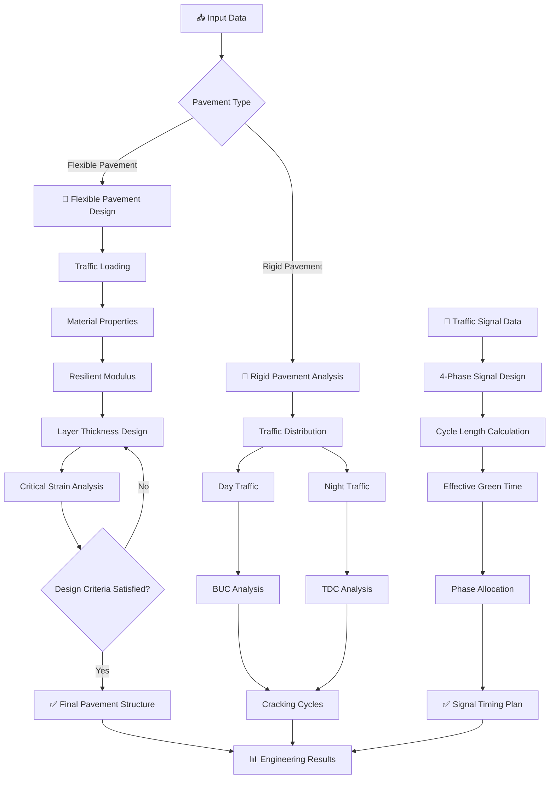
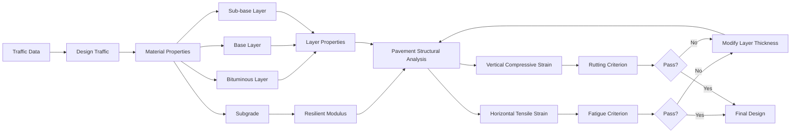
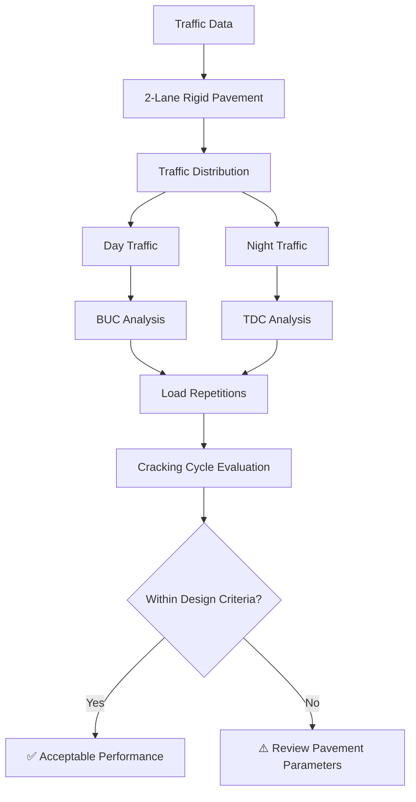
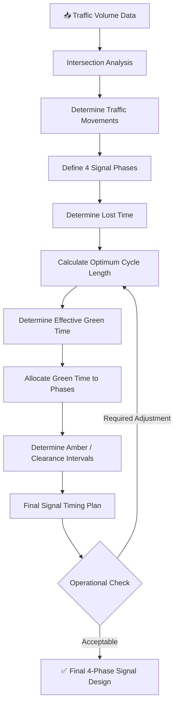
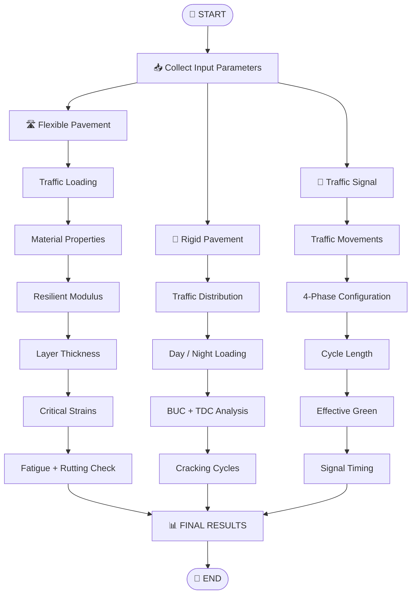

Yes — I’d make it much more like a **professional engineering research repository**: visual workflow diagrams, collapsible technical sections, calculation methodology, results placeholders, badges, navigation, and interactive GitHub elements. I’ll remove the Objectives section entirely.

# 🛣️ Pavement Evaluation & Design Analysis

### Technical Project & Research · August 2026

[](#)
[](#)
[](#)
[](#)

> **A computational highway engineering study covering flexible pavement structural design, rigid pavement cracking analysis, and four-phase traffic signal design using Indian Roads Congress (IRC) guidelines.**

---

## 📑 Table of Contents

* [📌 Project Overview](#-project-overview)
* [🗺️ Project Workflow](#️-project-workflow)
* [🏗️ Flexible Pavement Analysis](#️-flexible-pavement-analysis)
* [🔬 Mechanistic Pavement Evaluation](#-mechanistic-pavement-evaluation)
* [🧱 Rigid Pavement Analysis](#-rigid-pavement-analysis)
* [🚦 Traffic Signal Design](#-traffic-signal-design)
* [🔄 Complete Analysis Flowchart](#-complete-analysis-flowchart)
* [📊 Engineering Parameters](#-engineering-parameters)
* [📐 Design Methodology](#-design-methodology)
* [📈 Results & Outputs](#-results--outputs)
* [🧮 Critical Pavement Responses](#-critical-pavement-responses)
* [📚 IRC Standards](#-irc-standards)
* [📂 Repository Structure](#-repository-structure)
* [🧰 Tools & Technologies](#-tools--technologies)
* [🔍 Interactive Technical Details](#-interactive-technical-details)
* [📖 References](#-references)
* [👤 Author](#-author)

---

# 📌 Project Overview

This project presents an integrated **transportation and pavement engineering analysis** for highway infrastructure.

The study combines three major engineering components:

```text
┌──────────────────────────────────────────────────────────────┐
│              PAVEMENT EVALUATION & DESIGN                    │
└──────────────────────────────┬───────────────────────────────┘
                               │
             ┌─────────────────┼─────────────────┐
             │                 │                 │
             ▼                 ▼                 ▼
      FLEXIBLE PAVEMENT   RIGID PAVEMENT   TRAFFIC SIGNAL
             │                 │                 │
             ▼                 ▼                 ▼
       Layer Design       Traffic Loading    4-Phase Design
             │                 │                 │
             ▼                 ▼                 ▼
       Strain Analysis    BUC / TDC Cycles   Cycle Optimization
             │                 │                 │
             └─────────────────┼─────────────────┘
                               ▼
                    ENGINEERING EVALUATION
```

The project specifically investigates:

* Flexible pavement layer thickness
* Resilient modulus
* Horizontal tensile strain
* Vertical compressive strain
* Fatigue cracking potential
* Rutting potential
* Rigid pavement traffic distribution
* Day/night traffic loading
* BUC cracking cycles
* TDC cracking cycles
* Four-phase traffic signal operation
* Signal cycle length
* Effective green time
* IRC-based design criteria

---

# 🗺️ Project Workflow

The complete analysis follows the workflow below:



---

# 🏗️ Flexible Pavement Analysis

A **2-lane National Highway** was considered for the flexible pavement design analysis.

The pavement structure was evaluated using the methodology specified in:

> **IRC:37-2018 — Guidelines for the Design of Flexible Pavements**

The design process considers traffic loading, material properties, subgrade characteristics, pavement layer composition, and critical pavement responses.

---

## 🔄 Flexible Pavement Design Flowchart



---

# 🔬 Mechanistic Pavement Evaluation

The pavement structure was evaluated using critical strain responses associated with major pavement failure mechanisms.

## 1. Resilient Modulus

The **resilient modulus, \(M_r\)**, represents the elastic response of pavement/subgrade materials under repeated traffic loading.

It is an important input for mechanistic pavement analysis because repeated wheel loads produce recoverable and permanent deformation within pavement layers.

### Considered relationship

The resilient modulus is incorporated into the pavement response analysis to determine the structural response under design traffic.

---

## 2. Horizontal Tensile Strain

The **horizontal tensile strain** at the critical location of the bituminous layer is evaluated to assess fatigue performance.

```text
Traffic Loading
      │
      ▼
Bituminous Layer
      │
      ▼
Horizontal Tensile Strain
      │
      ▼
Repeated Loading
      │
      ▼
Fatigue Damage
      │
      ▼
Potential Fatigue Cracking
```

A higher repeated tensile strain can increase the potential for fatigue-related deterioration.

---

## 3. Vertical Compressive Strain

Vertical compressive strain near the subgrade is analyzed to assess permanent deformation and rutting potential.

```text
Wheel Load
    │
    ▼
Pavement Layers
    │
    ▼
Vertical Compressive Strain
    │
    ▼
Repeated Loading
    │
    ▼
Permanent Deformation
    │
    ▼
Rutting Potential
```

---

# 🧱 Rigid Pavement Analysis

The project also evaluates traffic loading on a **2-lane rigid pavement**.

The analysis considers traffic distribution under different operating periods and evaluates the resulting cracking cycles.

### Major parameters

| Parameter            | Description                        |
| -------------------- | ---------------------------------- |
| Traffic Distribution | Allocation of traffic loading      |
| Day Traffic          | Traffic loading during daytime     |
| Night Traffic        | Traffic loading during nighttime   |
| BUC                  | Critical cracking cycle assessment |
| TDC                  | Critical cracking cycle assessment |
| Wheel Loading        | Repeated pavement loading          |
| Cracking Cycles      | Pavement performance indicator     |

---

## 🔄 Rigid Pavement Analysis Flowchart



---

# 🚦 Traffic Signal Design

A **4-phase traffic signal system** was designed based on the principles of:

> **IRC:93-1985 — Guidelines on Design and Installation of Road Traffic Signals**

The signal design considers traffic movement, phase allocation, cycle length, and effective green time.

---

## 🚥 Four-Phase Signal Configuration

```text
                 INTERSECTION

              ┌───────────────┐
              │   PHASE 1     │
              │       ↓       │
              │               │
      PHASE 4 │      ✚        │ PHASE 2
              │               │
              │       ↑       │
              │   PHASE 3     │
              └───────────────┘
```

> The exact movement assignment can be customized according to the intersection geometry and traffic survey data.

---

## 🔄 Signal Design Flowchart



---

# 🔄 Complete Analysis Flowchart

The overall project integrates pavement design and traffic engineering into a single analytical workflow.



---

# 📊 Engineering Parameters

The following categories of engineering parameters form the basis of the analysis.

### 🛣️ Flexible Pavement

* Design traffic
* Lane distribution
* Vehicle loading
* Subgrade properties
* Resilient modulus
* Bituminous layer properties
* Base layer properties
* Sub-base properties
* Layer thickness
* Horizontal tensile strain
* Vertical compressive strain
* Fatigue criterion
* Rutting criterion

### 🧱 Rigid Pavement

* Traffic volume
* Axle loading
* Wheel loading
* Directional traffic distribution
* Day traffic
* Night traffic
* BUC loading
* TDC loading
* Number of load repetitions
* Cracking cycles

### 🚦 Signal Design

* Traffic volume
* Saturation flow
* Traffic movements
* Number of phases
* Lost time
* Cycle length
* Effective green time
* Amber interval
* Clearance interval
* Phase allocation

---

# 📐 Design Methodology

## Flexible Pavement

```text
Traffic Data
     ↓
Design Traffic
     ↓
Material Characterization
     ↓
Resilient Modulus
     ↓
Trial Pavement Structure
     ↓
Mechanistic Analysis
     ↓
Critical Strain Evaluation
     ↓
┌─────────────────────────┐
│ Tensile Strain → Fatigue│
│ Compressive → Rutting   │
└─────────────────────────┘
     ↓
Criteria Verification
     ↓
Layer Thickness Optimization
     ↓
Final Pavement Structure
```

---

## Rigid Pavement

```text
Traffic Input
     ↓
Traffic Distribution
     ↓
Day / Night Loading
     ↓
Wheel Load Repetitions
     ↓
BUC / TDC Analysis
     ↓
Cracking Cycle Calculation
     ↓
Performance Evaluation
```

---

## Traffic Signal

```text
Traffic Survey
     ↓
Movement Identification
     ↓
Phase Development
     ↓
Lost-Time Calculation
     ↓
Cycle Length
     ↓
Effective Green
     ↓
Phase Allocation
     ↓
Signal Timing Plan
```

---

# 📈 Results & Outputs

The repository can contain the following final outputs:

| Analysis           | Primary Output               |
| ------------------ | ---------------------------- |
| Flexible Pavement  | Optimized layer thickness    |
| Resilient Modulus  | Material response parameter  |
| Tensile Strain     | Fatigue performance          |
| Compressive Strain | Rutting performance          |
| Rigid Pavement     | Traffic loading distribution |
| BUC Analysis       | Cracking cycles              |
| TDC Analysis       | Cracking cycles              |
| Signal Design      | Optimum cycle length         |
| Signal Phasing     | Effective green allocation   |

---

## 📊 Suggested Results Dashboard

```text
╔══════════════════════════════════════════════════════╗
║          PAVEMENT DESIGN RESULTS DASHBOARD           ║
╠══════════════════════════════════════════════════════╣
║                                                      ║
║  FLEXIBLE PAVEMENT                                   ║
║  ├── Design Traffic          → [RESULT]             ║
║  ├── Bituminous Thickness    → [RESULT]             ║
║  ├── Base Thickness          → [RESULT]             ║
║  ├── Sub-base Thickness      → [RESULT]             ║
║  ├── Tensile Strain          → [RESULT]             ║
║  └── Compressive Strain      → [RESULT]             ║
║                                                      ║
║  RIGID PAVEMENT                                      ║
║  ├── Day Traffic             → [RESULT]             ║
║  ├── Night Traffic           → [RESULT]             ║
║  ├── BUC Cracking Cycles     → [RESULT]             ║
║  └── TDC Cracking Cycles     → [RESULT]             ║
║                                                      ║
║  TRAFFIC SIGNAL                                    ║
║  ├── Number of Phases        → 4                    ║
║  ├── Cycle Length            → [RESULT]             ║
║  └── Effective Green         → [RESULT]             ║
║                                                      ║
╚══════════════════════════════════════════════════════╝
```

Replace `[RESULT]` with the final values from the project calculations.

---

# 🧮 Critical Pavement Responses

## Fatigue Performance

The critical horizontal tensile strain is used to evaluate the susceptibility of the bituminous layer to repeated-load fatigue damage.


---

## Rutting Performance

Vertical compressive strain is evaluated to understand the potential for permanent deformation.


---

# 🔍 Interactive Technical Details

GitHub supports collapsible sections, allowing detailed calculations to remain accessible without making the main page excessively long.

<details>
<summary><strong>📐 Click to expand — Flexible Pavement Methodology</strong></summary>

### Flexible Pavement

The flexible pavement analysis consists of:

1. Determination of design traffic.
2. Selection of pavement materials.
3. Determination of relevant material properties.
4. Evaluation of resilient modulus.
5. Selection of trial layer thicknesses.
6. Structural response analysis.
7. Evaluation of horizontal tensile strain.
8. Evaluation of vertical compressive strain.
9. Verification against applicable criteria.
10. Iteration of layer thicknesses where required.
11. Selection of the final pavement structure.

</details>

<details>
<summary><strong>🧱 Click to expand — Rigid Pavement Methodology</strong></summary>

### Rigid Pavement

The rigid pavement analysis includes:

* Traffic distribution
* Directional loading
* Day/night traffic conditions
* Repeated wheel loading
* BUC analysis
* TDC analysis
* Cracking cycle determination

The resulting loading conditions are used to evaluate pavement performance.

</details>

<details>
<summary><strong>🚦 Click to expand — Signal Design Methodology</strong></summary>

### Traffic Signal

The four-phase signal design consists of:

* Identification of traffic movements
* Phase development
* Traffic demand assessment
* Lost-time consideration
* Cycle length determination
* Effective green calculation
* Green-time distribution
* Clearance interval consideration
* Final signal timing plan

</details>

<details>
<summary><strong>📚 Click to expand — Design Standards</strong></summary>

The primary design standards referenced in this project are:

**IRC:37-2018**

Guidelines for the Design of Flexible Pavements.

**IRC:93-1985**

Guidelines on Design and Installation of Road Traffic Signals.

</details>

---

# 📂 Repository Structure

```text
Pavement-Evaluation-Design-Analysis/
│
├── 📄 README.md
│
├── 📁 Flexible-Pavement/
│   │
│   ├── 📁 Input-Data/
│   │   ├── traffic-data.xlsx
│   │   ├── material-properties.xlsx
│   │   └── subgrade-data.xlsx
│   │
│   ├── 📁 Calculations/
│   │   ├── pavement-design.xlsx
│   │   └── strain-analysis.xlsx
│   │
│   └── 📁 Results/
│       ├── pavement-structure.pdf
│       └── strain-results.xlsx
│
├── 📁 Rigid-Pavement/
│   │
│   ├── 📁 Traffic-Distribution/
│   ├── 📁 BUC-Analysis/
│   ├── 📁 TDC-Analysis/
│   └── 📁 Results/
│
├── 📁 Traffic-Signal-Design/
│   │
│   ├── 📁 Traffic-Data/
│   ├── 📁 Signal-Phasing/
│   ├── 📁 Cycle-Length/
│   └── 📁 Results/
│
├── 📁 Figures/
│   ├── flexible-pavement.png
│   ├── rigid-pavement.png
│   └── signal-phasing.png
│
└── 📁 Documentation/
    └── Project-Report.pdf
```

---

# 🧰 Tools & Technologies

The project can be implemented using a combination of engineering calculation and data-analysis tools.

| Tool                 | Application                             |
| -------------------- | --------------------------------------- |
| 📊 Microsoft Excel   | Engineering calculations & tabulation   |
| 🐍 Python            | Numerical analysis / automation         |
| 📈 Matplotlib        | Engineering plots                       |
| 📐 IRC Guidelines    | Design methodology                      |
| 📄 PDF Documentation | Technical reporting                     |
| 🐙 GitHub            | Version control & project documentation |

---

# 📚 IRC Standards

| Code            | Standard                                                      | Application              |
| --------------- | ------------------------------------------------------------- | ------------------------ |
| **IRC:37-2018** | Guidelines for the Design of Flexible Pavements               | Flexible pavement design |
| **IRC:93-1985** | Guidelines on Design and Installation of Road Traffic Signals | Traffic signal design    |

> The calculations and assumptions in this repository should be interpreted together with the corresponding project inputs, calculation sheets, and referenced editions of the standards.

---

# 📖 References

1. Indian Roads Congress, **IRC:37-2018 — Guidelines for the Design of Flexible Pavements**.
2. Indian Roads Congress, **IRC:93-1985 — Guidelines on Design and Installation of Road Traffic Signals**.
3. Relevant transportation engineering and pavement design principles used in the analysis.
4. Project-specific traffic, material, and pavement design data.

---

# 👤 Author

### **Shubhayu Mandal**

**Technical Project & Research · August 2026**

Transportation Engineering · Pavement Design · Highway Engineering

---

## ⭐ Repository Note

This repository documents the analytical workflow, engineering calculations, assumptions, and resulting design outputs associated with the **Pavement Evaluation & Design Analysis** project.

The repository is intended as a technical reference for applications of pavement engineering and traffic engineering principles using IRC-based methodologies.

---

<p align="center">
  <b>🛣️ Pavement Engineering • 🚦 Traffic Engineering • 📊 Highway Design</b>
</p>

<p align="center">
  <i>Designed, analyzed, and documented using engineering-based methodologies.</i>
</p>

**One important GitHub detail:** the `mermaid` flowcharts above will render natively on modern GitHub README pages, while the `<details>` sections give you the interactive expand/collapse behavior. You can also add your actual Excel/PDF files and link them directly from the relevant sections for an even more complete research repository.
